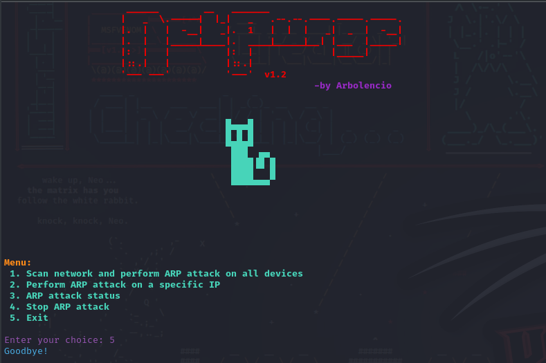

<div align="center">

# 🛡️ NetPurge

**Herramienta de seguridad de red local** — Bloquea el acceso a internet de intrusos en tu red mediante ARP spoofing.

[](https://github.com/Arbolencio/NetPurge)
[](https://www.gnu.org/software/bash/)
[](LICENSE)
[](https://github.com/Arbolencio/NetPurge/stargazers)
[](https://github.com/Arbolencio/NetPurge)



</div>

---

## 📋 Tabla de Contenidos

- [¿Qué es NetPurge?](#-qué-es-netpurge)
- [Funcionalidades](#-funcionalidades)
- [Cómo funciona](#-cómo-funciona)
- [Requisitos](#-requisitos)
- [Instalación](#-instalación)
- [Uso](#-uso)
  - [Menú principal](#menú-principal)
  - [Opción 1: Escanear y atacar toda la red](#opción-1-escanear-y-atacar-toda-la-red)
  - [Opción 2: Atacar una IP específica](#opción-2-atacar-una-ip-específica)
  - [Opción 3: Estado del ataque](#opción-3-estado-del-ataque)
  - [Opción 4: Detener ataque](#opción-4-detener-ataque)
  - [Opción 5: Excluir IPs](#opción-5-excluir-ips)
- [Advertencias](#-advertencias)
- [Estructura del proyecto](#-estructura-del-proyecto)
- [Contribuir](#-contribuir)
- [Licencia](#-licencia)

---

## 🎯 ¿Qué es NetPurge?

**NetPurge** es un script en Bash que automatiza la detección y bloqueo de dispositivos no autorizados en tu red local. Utiliza técnicas de **ARP spoofing** (envenenamiento ARP) para interceptar y descartar paquetes de red, impidiendo que dispositivos intrusos accedan a internet a través de tu red.

> ⚠️ **Esta herramienta es para fines educativos y de seguridad ofensiva en redes propias.**
> **No la utilices en redes sobre las que no tengas autorización explícita.**

---

## ⚡ Funcionalidades

| Función | Descripción |
|---------|-------------|
| 🔍 **Escaneo de red** | Descubre todos los dispositivos conectados usando `arp-scan` |
| 🚫 **Bloqueo masivo** | Lanza ARP spoofing contra todos los hosts detectados |
| 🎯 **Ataque dirigido** | Bloquea una IP específica |
| 🗑️ **Exclusión de IPs** | Protege dispositivos legítimos (tu PC, servidor, etc.) |
| 📊 **Estado en tiempo real** | Comprueba si hay ataques activos |
| ⏹️ **Detención limpia** | Para todos los procesos de ataque de forma segura |
| 🎨 **Interfaz interactiva** | Menú terminal con colores y navegación sencilla |

---

## 🔬 Cómo funciona

```
┌─────────────────────────────────────────────────────────┐
│                    FLUJO DE NETPURGE                     │
├─────────────────────────────────────────────────────────┤
│                                                         │
│  1. Escanea la red local con arp-scan                   │
│     ↓                                                   │
│  2. Lista todos los dispositivos encontrados            │
│     ↓                                                   │
│  3. Excluye IPs protegidas (opcional)                   │
│     ↓                                                   │
│  4. Lanza arpspoof en background contra cada objetivo   │
│     ↓                                                   │
│  5. El gateway recibe los paquetes pero no los reenvía   │
│     → El objetivo pierde conexión a internet            │
│                                                         │
└─────────────────────────────────────────────────────────┘
```

### Técnica: ARP Spoofing

El envenenamiento ARP explota el protocolo ARP de las redes locales. NetPurge envía respuestas ARP falsificadas al objetivo:

```
[Tu Pi] ──ARP reply──→ [Objetivo]
"Dirección MAC del gateway = MAC de Tu Pi"

[Tu Pi] ──ARP reply──→ [Gateway]  
"Dirección MAC del Objetivo = MAC de Tu Pi"
```

El tráfico del objetivo pasa por tu máquina y es descartado, bloqueando efectivamente su acceso a internet sin desconectarlo de la red.

---

## 📦 Requisitos

- **Sistema operativo**: Linux (Debian/Ubuntu, Arch, Kali, etc.)
- **Permisos**: Root o `sudo` (necesario para manipular paquetes de red)
- **Dependencias**:

| Paquete | Función | Enlace |
|---------|---------|--------|
| `dsniff` | Suite de herramientas de red (incluye arpspoof) | [monkey.org](https://www.monkey.org/~dugsong/dsniff/) |
| `arp-scan` | Escáner de red ARP | [github.com](https://github.com/royhills/arp-scan) |
| `netdiscover` | Descubrimiento de hosts | [github.com](https://github.com/alexxy/netdiscover) |

> **Nota**: `netdiscover` está listado como requisito en el README original pero no se utiliza directamente en el script. La herramienta principal es `arp-scan`.

---

## 🚀 Instalación

### Paso 1: Instalar dependencias

En sistemas basados en Debian/Ubuntu:

```bash
sudo apt update
sudo apt install -y dsniff arp-scan netdiscover
```

En Arch/Manjaro:

```bash
sudo pacman -S dsniff arp-scan netdiscover
```

En Kali Linux (ya viene preinstalado):

```bash
sudo apt update
sudo apt install -y dsniff arp-scan
```

### Paso 2: Clonar el repositorio

```bash
git clone https://github.com/Arbolencio/NetPurge.git
cd NetPurge
```

### Paso 3: Dar permisos de ejecución

```bash
chmod +x NetPurge.sh
```

### Paso 4: Ejecutar

```bash
sudo ./NetPurge.sh
```

> **Importante**: Se requieren permisos de superusuario para ejecutar las herramientas de ARP spoofing.

---

## 🎮 Uso

### Menú principal

Al ejecutar el script verás el banner y el menú:

```
 ______        __   _______                      
|   _  \.-----|  |_|   _   .--.--.----.-----.-----.
|.  |   |  -__|   _|.  1   |  |  |   _|  _  |  -__|
|.  |   |_____|____|.  ____|_____|__| |___  |_____|
|:  |   |          |:  |              |_____|
|::.|   |          |::'|
'--- ---'          '---'  v1.2

                                                        -by Arbolencio

Menu:
 1. Scan network and perform ARP attack on all devices
 2. Perform ARP attack on a specific IP
 3. ARP attack status
 4. Stop ARP attack
 5. Exclude specific IPs from attack
 6. Exit
```

### Opción 1: Escanear y atacar toda la red

Escanea la red local, descubre todos los dispositivos activos y lanza un ataque ARP spoofing contra todos ellos automáticamente.

```
Enter interface name (e.g., eth0, wlan0): wlan0
Scanning network for active hosts...
Active hosts on the network:
192.168.1.101
192.168.1.102
192.168.1.103
Performing ARP spoofing attack against all discovered hosts in background...
ARP spoofing attack launched against all discovered hosts (except excluded ones).
```

### Opción 2: Atacar una IP específica

Permite especificar una única dirección IP para bloquear.

```
Enter interface name (e.g., eth0, wlan0): wlan0
Enter the target's IP: 192.168.1.105
Performing ARP spoofing attack against 192.168.1.105 in background...
ARP spoofing attack launched against 192.168.1.105.
```

### Opción 3: Estado del ataque

Comprueba si hay procesos de ARP spoofing activos:

```
ARP attack is running.
```

### Opción 4: Detener ataque

Mata todos los procesos `arpspoof` activos:

```
ARP attack stopped successfully.
```

### Opción 5: Excluir IPs

Permite proteger dispositivos legítimos para que no sean afectados por el ataque masivo:

```
Scanning network for active hosts...
Active hosts on the network:
1. 192.168.1.101
2. 192.168.1.102
3. 192.168.1.104

Enter the numbers of IPs to exclude (separated by space): 1 3
Excluding IP 192.168.1.101
Excluding IP 192.168.1.104
The following IP(s) have been excluded from the attack: 192.168.1.101 192.168.1.104
```

---

## ⚠️ Advertencias

> **LEGAL**: Esta herramienta debe utilizarse **únicamente** en redes sobre las que tengas autorización explícita. El uso de ARP spoofing en redes ajenas es **ilegal** en la mayoría de jurisdicciones.

> **TÉCNICA**: El ARP spoofing interrumpe la conectividad del objetivo. Asegúrate de haber excluido las IPs de tus propios dispositivos y equipos críticos (router, servidor, etc.).

> **SEGURIDAD**: Los procesos de `arpspoof` corren en background. Usa la opción 4 para detenerlos limpiamente, o `pkill arpspoof` manualmente si es necesario.

---

## 📁 Estructura del proyecto

```
NetPurge/
├── NetPurge.sh       # Script principal (interfaz + lógica de ataque)
├── NetPurge.PNG      # Captura de pantalla del script en ejecución
├── dibujo.txt        # Arte ASCII del banner
├── README.md         # Este archivo
└── .git/             # Historial de versiones
```

---

## 🤝 Contribuir

Las contribuciones son bienvenidas. Si tienes ideas para mejorar NetPurge:

1. **Fork** del repositorio
2. Crea una rama: `git checkout -b feature/nueva-funcionalidad`
3. Haz tus cambios y commitea: `git commit -m "Añade nueva funcionalidad"`
4. Push a tu rama: `git push origin feature/nueva-funcionalidad`
5. Abre un **Pull Request**

### Ideas de mejora

- [ ] Soporte para múltiples interfaces simultáneas
- [ ] Modo automático (re-ataque continuo si se reestablece la conexión)
- [ ] Exportar log de dispositivos bloqueados
- [ ] Interfaz web de control
- [ ] Detección automática de gateway
- [ ] Soporte para IPv6 (NDP spoofing)

---

## 📜 Licencia

Distribuido bajo la licencia **GPL-3.0**. Ver el archivo [LICENSE](LICENSE) para más detalles.

---

<div align="center">

**Hecho con 🔴 por [Arbolencio](https://github.com/Arbolencio)**

*Para seguridad de redes locales*

</div>
